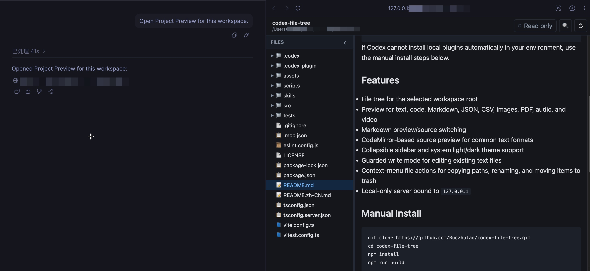

# Project Preview

> 🧭 **像内置文件树一样使用。** Project Preview 直接运行在 Codex App 的内置浏览器里，
> 无需外部窗口，也不用切换上下文。



Project Preview 是一个本地 Codex 插件，用来在 Codex 内置浏览器中预览当前工作目录。

> 🐛 **为什么会有这个项目：** Project Preview 是为绕过 Codex App 文件树“隐身”
> 问题而生：点击 `View > Toggle File Tree` 或使用快捷键都不能让文件树出现，
> 用户只能通过很绕的路径重新打开项目文件。如果上游修复了这个问题，
> 这个插件可能就不再那么必要。见
> [openai/codex#20552](https://github.com/openai/codex/issues/20552#issuecomment-4411037859)。

[English README](README.md)

## 用 Codex 快速安装

打开 Codex，直接粘贴这段请求：

```text
Install Project Preview from https://github.com/Theoz001/codex-file-tree as a local Codex plugin. Read the repository README first, then clone it, install dependencies, run npm run build, link or install it as a local plugin, reload plugins if needed, and open Project Preview for my current workspace.
```

安装后，可以继续让 Codex 执行：

```text
Open Project Preview for this workspace.
```

如果你的 Codex 环境不能自动安装本地插件，再使用下面的手动安装方式。

## 核心功能

- 浏览当前 workspace 的文件树
- 预览文本、代码、Markdown、JSON、CSV、图片、PDF、音频和视频
- Markdown 预览和源码切换
- 使用 CodeMirror 预览常见文本格式
- 可折叠侧边栏，并跟随系统明暗主题
- 正在运行的预览列表，可在多个 Project Preview 项目间切换
- 受保护的 Write mode，可编辑已有文本文件
- 右键菜单支持复制路径、重命名、移动到项目内文件夹、移入废纸篓
- 本地服务只绑定 `127.0.0.1`

## 手动安装

```bash
git clone https://github.com/Theoz001/codex-file-tree.git
cd codex-file-tree
npm install
npm run build
```

作为 Codex 插件使用时，把这个仓库安装或链接为本地插件，然后重载 Codex，让
`project-preview` 插件被发现。

## 更新

如果你是本地 clone 这个仓库，更新时执行：

```bash
cd /path/to/codex-file-tree
git pull
npm install
npm run build
```

然后重载或重启 Codex，让本地插件缓存刷新。如果 Codex 仍然打开旧版本，
重新从这个目录安装或重新 link 本地插件。

## 使用

为当前目录启动或复用预览服务：

```bash
npm start -- url --root "$PWD"
```

常用命令：

```bash
project-preview url --root /path/to/project
project-preview start --root /path/to/project --port 8098
project-preview stop --root /path/to/project
project-preview list
```

服务会返回类似这样的本地地址：

```text
http://127.0.0.1:8098/p/my-project/
```

## 安全边界

- 服务只绑定 `127.0.0.1`
- 不启用 CORS
- 所有文件访问限制在指定 workspace root 内
- 阻止路径穿越和指向 root 外部的 symlink
- 写操作需要先在界面中开启 Write mode
- 写接口需要当前进程生成的 write token
- 保存操作只写入已有文本文件，并受预览大小限制
- 重命名、移动和移入废纸篓只允许 root 内部的文件和目录
- 移动操作会拒绝目标重名，并阻止把目录移动到自身内部
- `.git`、`node_modules`、`dist`、`build` 等受保护路径不能通过写接口修改

## API

只读接口：

- `GET /api/health`
- `GET /api/meta`
- `GET /api/previews`
- `GET /api/tree?path=...`
- `GET /api/folders`
- `GET /api/file?path=...`
- `GET /api/raw?path=...`

写入接口：

- `POST /api/file/save`
- `POST /api/fs/rename`
- `POST /api/fs/move`
- `POST /api/fs/trash`

写入接口需要 `GET /api/meta` 返回的 `x-project-preview-write-token`。

## 隐私

- Project Preview 不上传文件
- Project Preview 不发送遥测数据
- 文件内容只由本地 `127.0.0.1` 预览服务在指定 workspace root 内提供

## 检查

```bash
npm run lint
npm run test
npm run build
npm audit
```
